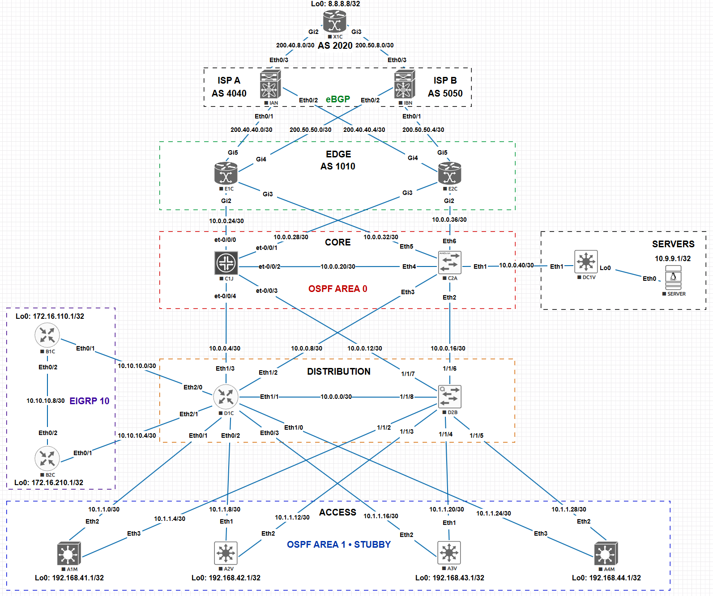

# ✨ dblCheck

[](https://github.com/pdudotdev/dblCheck/releases/tag/1.1.0)

[](https://github.com/pdudotdev/dblCheck/commits/main/)

| | |
|---|---|
| **Platforms** |        |
| **Transport** |  |
| **Integrations** |     |

## 📖 **Table of Contents**
- 📜 **dblCheck**
  - [🔭 Overview](#-overview)
  - [🍀 Here's a Quick Demo](#-heres-a-quick-demo)
  - [⭐ What's New in v1.0](#-whats-new-in-v10)
  - [⚒️ Core Tech Stack](#️-core-tech-stack)
  - [📋 Validation Scope](#-validation-scope)
  - [🛠️ Installation & Usage](#️-installation--usage)
  - [🦾 Daemon Mode](#-daemon-mode)
  - [🔄 Test Network Topology](#-test-network-topology)
  - [⬆️ Planned Upgrades](#️-planned-upgrades)
  - [♻️ Repository Lifecycle](#️-repository-lifecycle)
  - [📄 Disclaimer](#-disclaimer)
  - [📜 License](#-license)
  - [📧 Collaborations](#-collaborations)

## 🔭 Overview
AI-assisted **network intent validation framework** for multi-vendor environments. 
Continuously checks live network state against design intent and invokes a Claude agent to diagnose, explain, and document failures.

▫️ **Key characteristics:**
- [x] **Intent-driven validation** — Define expected state in NetBox config contexts, dblCheck does the rest
- [x] **AI root-cause diagnosis** — Claude agent investigates failures using 8 read-only MCP tools
- [x] **Read-only** — Agent queries and investigates devices, never configures
- [x] **Real-time dashboard** — Live validation results and streamed AI diagnosis
- [x] **Daemon mode** — Scheduled validation runs, always-on monitoring
- [x] **HashiCorp Vault** — All secrets (device creds, NetBox token, Jira key etc.) stored in Vault
- [x] **NetBox** — Device inventory loaded automatically
- [x] **CI/CD ready** — JSON output mode + exit codes
- [x] **350 tests** — 14 suites (12 unit + 2 integration)

▫️ **Supported models:**
- [x] Haiku 4.5
- [x] Sonnet 4.6
- [x] Opus 4.6 (default, best reasoning)

## 🍀 Here's a Quick Demo
- [x] *Demo video coming soon...*

## ⭐ What's New in v1.0
- [x] See [**CHANGELOG.md**](CHANGELOG.md)
 
## ⚒️ Core Tech Stack

| Tool | |
|------|---|
| Claude Code | ✓ |
| MCP (FastMCP) | ✓ |
| Python | ✓ |
| Scrapli | ✓ |
| HashiCorp Vault | ✓ |
| NetBox | ✓ |
| Jira | ✓ |

## 📋 Validation Scope

| Protocol | What's Checked |
|----------|---------------|
| **OSPF** | Neighbor state (FULL), area config, process config |
| **EIGRP** | Neighbor state, interfaces, topology |
| **BGP** | Peer state (Established), prefix counts |
| **Interfaces** | Up/down state, expected operational status |

## 🛠️ Installation & Usage

▫️ **Prerequisites:**
- Python 3.11+
- HashiCorp Vault
- NetBox
- Jira (optional)

▫️ **Step 1 — Install:**
```
git clone https://github.com/pdudotdev/dblCheck /opt/dblcheck
cd /opt/dblcheck
python3 -m venv dbl
dbl/bin/pip install -r requirements.txt
```

▫️ **Step 2 — Vault:**

Start Vault (dev mode, lab use):
```
vault server -dev -dev-root-token-id=<your-root-token>
export VAULT_ADDR=http://127.0.0.1:8200
export VAULT_TOKEN=<your-root-token>
```

Or initialize and unseal an existing Vault instance:
```
vault operator init -key-shares=1 -key-threshold=1   # first-time setup
vault operator unseal                                  # after every restart
```

> 🔑 Save the unseal key output from `vault operator init` somewhere safe — you'll need it every time Vault restarts or seals. Without it, a sealed Vault cannot be recovered.

> ⚠️ dblCheck requires Vault to be **running and unsealed** before any run. If Vault is unavailable, credential lookups fall back to env vars (see `.env.example`).

Store secrets:
```
vault kv put secret/dblcheck/router username=<user> password=<pass>
vault kv put secret/dblcheck/netbox token=<token>
vault kv put secret/dblcheck/jira token=<token>
vault kv put secret/dblcheck/dashboard token=<token>
# vault kv put secret/dblcheck/anthropic api_key=<key>
```

▫️ **Step 3 — Configure `.env`:**
- [x] See [**example**](.env.example)
```
cp .env.example .env
```

▫️ **Step 4 — Claude auth**:

Option A — Anthropic account:
```
claude login
```
Option B — API key via Vault.

▫️ **Step 5 — Register the MCP server:**
```
claude mcp add dblcheck -s user -- /home/<user>/dbl/bin/python server/MCPServer.py
```

▫️ **Step 6 — Run:**
```
dbl/bin/python cli/dblcheck.py                          # full validation
dbl/bin/python cli/dblcheck.py --device C1C             # single device
dbl/bin/python cli/dblcheck.py --protocol ospf          # limit to one protocol
dbl/bin/python cli/dblcheck.py --no-diagnose            # skip AI diagnosis
dbl/bin/python cli/dblcheck.py --format json            # JSON output for CI/CD
dbl/bin/python cli/dblcheck.py --headless               # daemon / no terminal output
```

## 🦾 Daemon Mode

dblCheck runs as a **systemd daemon** that validates the network on a schedule and serves a live dashboard.

▫️ **Install the service:**
```
sudo deploy/install.sh
```
Detects your install path and user automatically — no manual editing required.

▫️ **Manage with:**
`systemctl start | stop | restart | status dblcheck`

▫️ **Dashboard:**
```
http://localhost:5556
```
Shows live validation results and streams AI diagnosis output when failures are found. Port is configurable via `DASHBOARD_PORT` in `.env`.

⚠️ **NOTE:** The daemon validates every 300 seconds by default. Change with `INTERVAL=<seconds>` in `.env`.

## 🔄 Test Network Topology

▫️ **Network diagram:**



▫️ **Lab environment:**
- [x] 16 devices defined in [**TOPOLOGY.yml**](TOPOLOGY.yml)
- [x] 5 × Cisco IOL nodes (IOS)
- [x] 3 × Cisco c8000v nodes (IOS-XE)
- [x] 3 × Vyatta VyOS nodes
- [x] 2 × MikroTik CHR nodes
- [x] 1 × Juniper JunOS node
- [x] 1 × Arista cEOS node
- [x] 1 x Aruba AOS-CX node
- [x] OSPF multi-area, EIGRP, BGP
- [x] Device credentials stored in **Vault**

## ⬆️ Planned Upgrades
- [ ] New protocols supported

## ♻️ Repository Lifecycle
**New features** are being added periodically (protocols, integrations, optimizations).

**Stay up-to-date**:
- [x] **Watch** and **Star** this repository

## 📄 Disclaimer
You are responsible for defining your own network intent (NetBox config contexts), building your test environment, and meeting the necessary conditions (Python 3.11+, Claude CLI, HashiCorp Vault, etc.).

## 📜 License
Licensed under the [**Business Source License 1.1**](LICENSE).
Source code is available for research, educational, and non-commercial use. Commercial use, SaaS deployment, enterprise integration, or paid services require a commercial license.

## 📧 Collaborations
Interested in collaborating?
- **Email:**
  - Reach out at [**hello@ainoc.dev**](mailto:hello@ainoc.dev)
- **LinkedIn:**
  - Let's discuss via [**LinkedIn**](https://www.linkedin.com/in/tmihaicatalin/)
